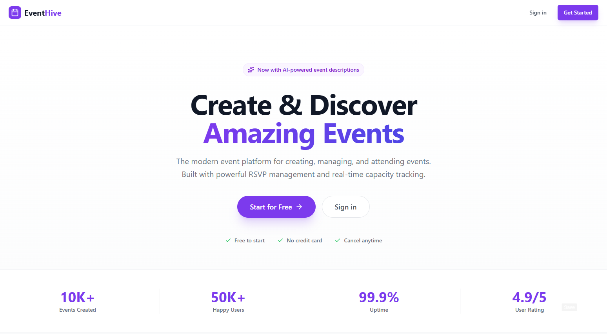
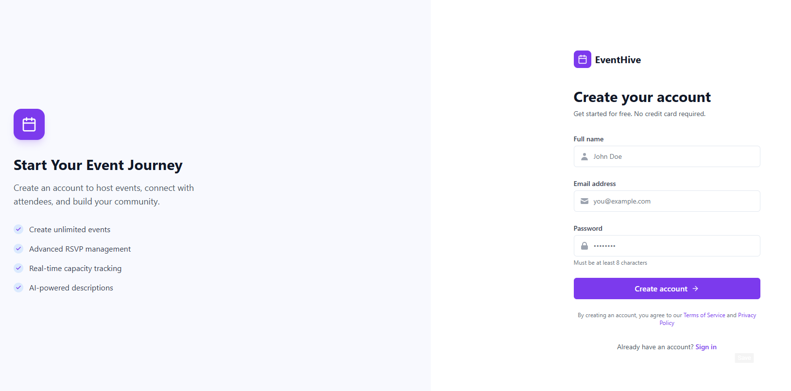
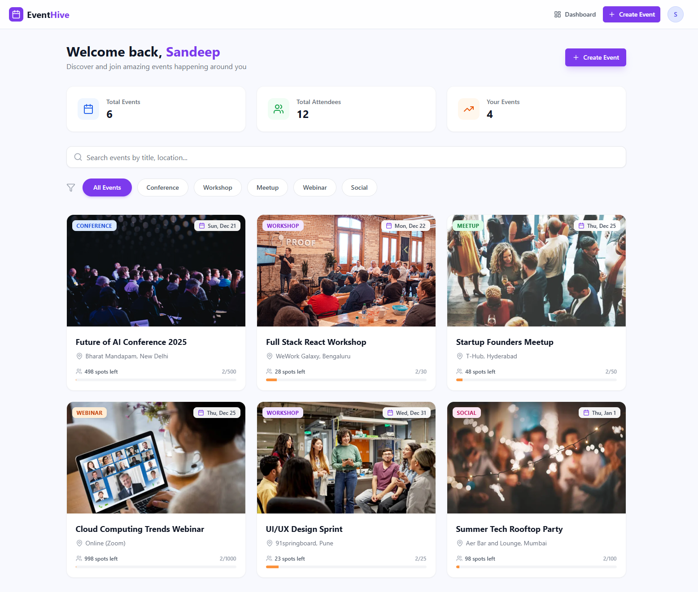
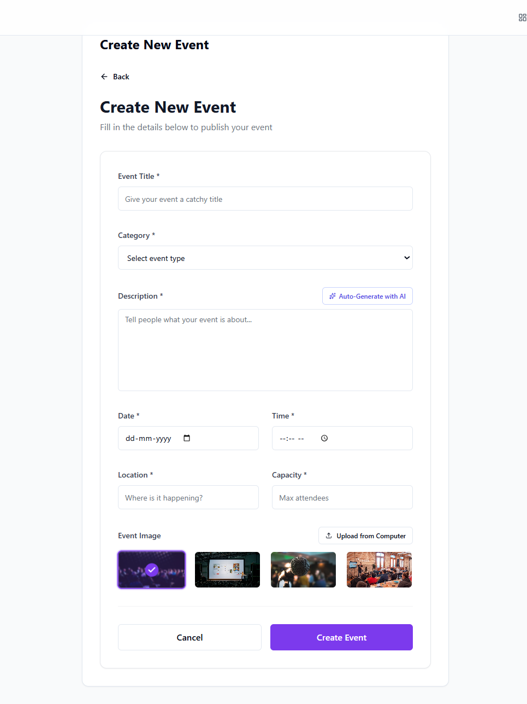
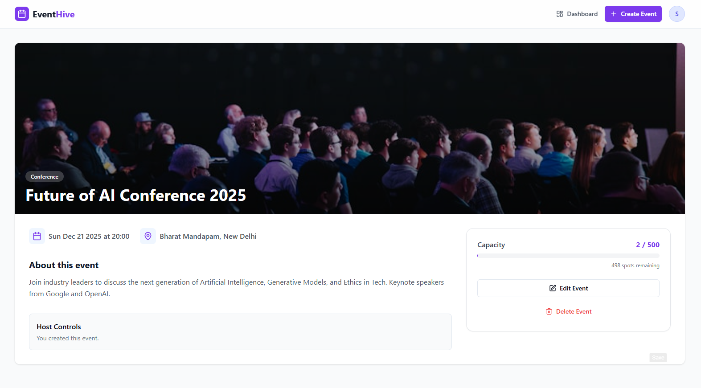
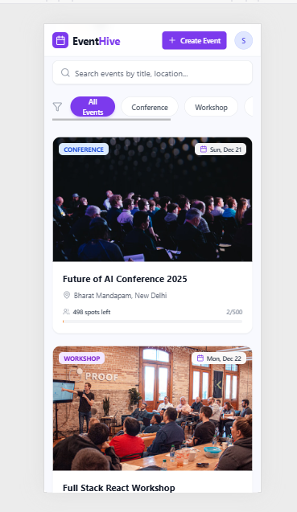

# EventHive


> **A modern, full-stack event management platform built for speed, security, and scalability.**

## Overview

EventHive is a robust web application designed to simplify how users create, discover, and manage events. Built on the **MERN stack** (MongoDB, Express.js, React, Node.js), it solves real-world challenges like **concurrent booking management** and **secure user authentication**.

This project was developed as a comprehensive solution demonstrating advanced backend logic, including atomic database operations to prevent overbooking, and integrates **Google Gemini AI** to assist users in generating professional event content.

---

## Key Features

### Core Functionality
* **Secure Authentication:** Complete Signup/Login system using **JWT** (JSON Web Tokens) and **Bcrypt** for password hashing. Includes strict regex validation for strong passwords.
* **Event CRUD:** Users can Create, Read, Update, and Delete events. (Edit/Delete restricted to the event creator).
* **Image Handling:** Hybrid image system allowing users to select high-quality default themes or **upload custom images** from their local device.
* **RSVP System:** Real-time capacity tracking. Users can join/leave events, and the system automatically locks RSVPs when capacity is full.

### Advanced Enhancements
* **AI-Powered Descriptions:** Integrated **Google Gemini API** to auto-generate engaging event descriptions based on just a title and category.
* **Smart Filtering:** Full-text search by title/location and category-based filtering (Conference, Workshop, Meetup, etc.).
* **User Dashboard:** A dedicated "My Events" area with tabbed views to track events you are **Hosting** vs. events you are **Attending**.
* **Modern UI/UX:** Fully responsive design built with **Tailwind CSS**, **Shadcn UI**, and Framer Motion for smooth transitions.

---

## Technical Deep Dive: Solving Concurrency

One of the critical challenges in event management systems is handling **race conditions**—where multiple users try to book the last available spot simultaneously.

**The Problem:**
A standard "Read-Modify-Write" approach (Read capacity -> Check if full -> Update) fails under load because two requests can read the same "available" capacity before either writes the update.

**My Solution:**
I implemented **Atomic Database Operations** using MongoDB. Instead of checking logic in JavaScript, I push the validation down to the database layer.

```javascript
// server/controllers/eventController.js

const updatedEvent = await Event.findOneAndUpdate(
  { 
    _id: eventId, 
    attendees: { $ne: userId },          // 1. Ensure user isn't already joined
    $expr: { $lt: [{ $size: "$attendees" }, "$capacity"] } // 2. ATOMIC CHECK: Ensure current attendees < Capacity
  },
  { 
    $push: { attendees: userId }         // 3. Update only if conditions met
  },
  { new: true }
);

```

Result: The database locks the document during the update. If the condition fails (e.g., event became full 1ms ago), the operation returns null, and the backend safely rejects the request without overbooking.

## Tech Stack
# Frontend (Client):

React.js (Vite)

Tailwind CSS & Shadcn UI

React Router DOM

Axios & Lucide React Icons

# Backend (Server):

Node.js & Express.js

MongoDB & Mongoose

JWT & Bcryptjs

Multer (File Uploads)

Google Generative AI SDK

# Getting Started (Run Locally)
Follow these steps to set up the project on your local machine.

Prerequisites
Node.js (v16+)

MongoDB (Local or Atlas URL)

Google Gemini API Key (Optional, for AI features)

1. Clone the Repository

git clone [https://github.com/sandeep-kumar-21/EventHive.git](https://github.com/sandeep-kumar-21/EventHive.git)
cd EventHive

2. Server Setup
Navigate to the server folder and install dependencies.

cd server
npm install

Configure Environment Variables: Create a .env file in the server directory:

Code snippet
PORT=5000
MONGO_URI=mongodb://localhost:27017/eventhive
JWT_SECRET=your_super_secret_key_123
GEMINI_API_KEY=your_google_ai_studio_key

Start the Server: npm run dev

# Server runs on http://localhost:5000

3. Client Setup
Open a new terminal, navigate to the client folder, and install dependencies.

cd client
npm install

Configure Environment Variables: Create a .env file in the client directory:

Code snippet

VITE_API_URL=http://localhost:5000/api
Start the Client:

npm run dev

# App runs on http://localhost:5173
Project Structure
Plaintext

EventHive/
├── server/
│   ├── config/
│   │   └── db.js               # Database connection
│   ├── controllers/
│   │   ├── authController.js   # Login/Signup logic
│   │   └── eventController.js  # Event CRUD & RSVP Logic
│   ├── middleware/
│   │   └── authMiddleware.js   # Protect routes
│   ├── models/
│   │   ├── Event.js            # Mongoose Schema
│   │   └── User.js             # Mongoose Schema
│   ├── routes/
│   │   ├── authRoutes.js
│   │   └── eventRoutes.js
│   ├── .env                    # Environment variables
│   └── server.js               # Entry point
│
└── client/
    ├── public/
    │   └── ... (favicon, etc.)
    ├── src/
    │   ├── components/
    │   │   ├── events/
    │   │   │   ├── CreateEventForm.jsx
    │   │   │   ├── EventCard.jsx
    │   │   │   └── EventFilters.jsx
    │   │   ├── layout/
    │   │   │   └── Navbar.jsx
    │   │   └── ui/             # (Button, Input, etc. - Standard Shadcn/Tailwind UI)
    │   ├── context/
    │   │   ├── AuthContext.jsx
    │   │   └── EventContext.jsx
    │   ├── hooks/
    │   │   ├── use-mobile.js
    │   │   └── use-toast.js
    │   ├── lib/
    │   │   ├── axios.js        # API configuration
    │   │   └── utils.js
    │   ├── pages/
    │   │   ├── CreateEvent.jsx
    │   │   ├── Dashboard.jsx
    │   │   ├── EventDetails.jsx
    │   │   ├── Index.jsx
    │   │   ├── Landing.jsx
    │   │   ├── Login.jsx
    │   │   ├── MyEvents.jsx
    │   │   ├── NotFound.jsx
    │   │   └── Signup.jsx
    │   ├── App.jsx
    │   ├── index.css
    │   └── main.jsx
    ├── index.html
    ├── package.json
    ├── tailwind.config.js
    └── vite.config.js


## Project Gallery

<details>
<summary>Click to view screenshots</summary>

### Landing Page


### Signup page


### User Dashboard


### Create Event Form


### Event Details


### Mobile View


</details>


## Author

**Sandeep Kumar**
* **Role:** Full Stack Developer
* **Education:** Master of Computer Applications (MCA'26), NIT Raipur
* **Linkedin:** https://www.linkedin.com/in/sandeep-kumar-s21